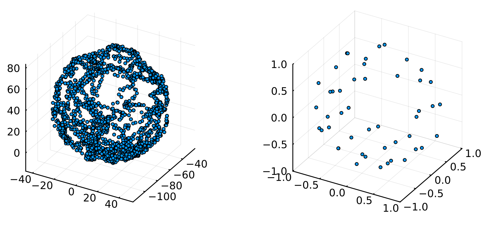

# 3D magnetometer calibration utility for Rust

This library is built to support `no_std` and uses `nalgebra` to do matrix operations and is therefore fit for use in highly embedded Rust applications. The primary object is the `MagCalibrator<N>`, which does two things:
- Accept a sample (`[f32; 3]` or `Vector3<f32>`) from the user and evaluate whether it is "more unique than the least unique sample in the `N`-element buffer" and if it is, add it to the buffer, removing the less useful sample. Otherwise ignore it.
- When the mean distance between the samples is above a threshold (decided by the user), `MagCalibrator::perform_calibration()` is called. This uses least squares to obtain the best-fitting offset and scale parameters for the sample set. 

---

This functionality is illustrated in the following image. **Left** shows a large set of uncalibrated samples, the sphere of which has a large offset from the origin.
**Right** shows the set of "`N` most unique" samples (`N = 50` in this case), which have been used for calibrating the same set of samples. Notice how the sampels are fitted to the unit sphere around the origin.

    

## Origin
This library was written as an assignment "mini-project" for a course on Sensors and Systems at Aalborg University. The handed-in paper can be found in [Mini-project.pdf](Mini-project.pdf).

## License
The code in this repository is licensed under the Apache 2.0 License.
